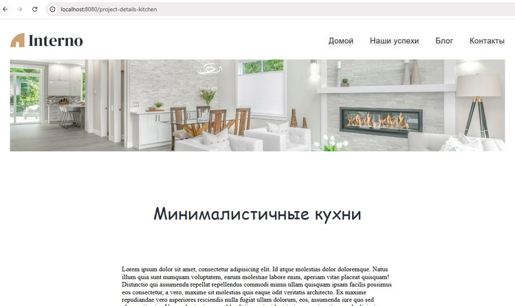
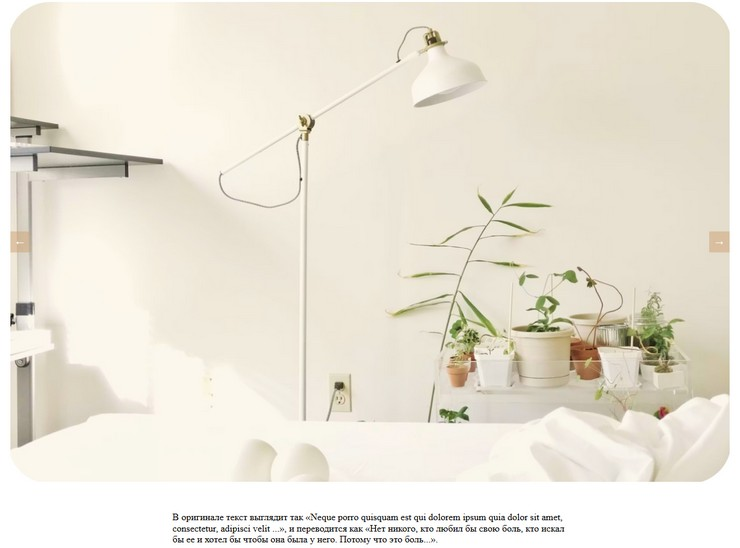

# Фреймворк Vue.js. Обучение в записи

# Урок 14. Семинар: Управление данными приложения с VueX
## Работа с макетом

Установите VueX и добавьте к проекту.<br><br>

Приступаем к вёрстке новой страницы project details (Домашнее задание 7).<br>
Информацию про описание проекта вынести в state.<br><br>

* Слайдер можно сделать самостоятельно с помощью vue или сделать с помощью bootstrap.<br>

<br>

#### Задание по работе с макетом направлено на подготовку проекта к итоговой аттестации.

<br><br>

#### Формат сдачи: ссылка на гитхаб.

<br><br>

### Решение задания

Перейти в папку с проектом и выполнить запуск:
```
npm run serve

```

<br><br>

#### Задача 1

#### Установка Vuex версии 3 и выше в проект на Vue CLI

1. Устанавливаем Vuex командой в консоли:
```
npm install vuex@3 --save

```
2. Если отсутствует, создаем папку (каталог) store в папке src.
3. Создаем файл src/store/index.js 
```
import Vue from 'vue';
import Vuex from 'vuex';

Vue.use(Vuex);

export default new Vuex.Store({
  state: {
    projectDescription: '<!-- описание проекта --->'
  },
  getters: {
    getProjectDescription: state => state.projectDescription
  },
  mutations: {
    setProjectDescription(state, description) {
      state.projectDescription = description;
    }
  },
  actions: {
    updateProjectDescription({ commit }, description) {
      commit('setProjectDescription', description);
    }
  }
});

```
4. Подключаем каталог store к приложению Vue в файле src/main.js, импортируем хранилище:
```
import store from './store';

```
5. Проверить версию Vuex можно командой:
``` 
npm list vuex
```

6. Проверить версию Vue можно проверить через команду:

```
npm list vue

```
7. Создаем описание проекта и записываем через Vuex.

<br><br>

#### Задача 2

Создаем и подключаем к проекту компонент страницы project details


<br><br>

#### Задача 3

Перенесем данные страницы project details в state через Vuex, чтобы можно было проще получать данные, например, страницы ProjectDetailsKitchen.vue.
Это данные изображений для карусели (carouselImages). <br>
Компоненты Header и Footer будут не затронуты, останутся как компоненты Vue. <br>
Следует записать маршрут к данной странице в файле router/index.js для [Vue Router](https://router.vuejs.org/). <br><br>
Страница с компонентами Carousel будет открываться по адресу браузера <br>
http://localhost:8080/project-details-kitchen с набором данных из Vuex хранилища.



#### Задача 4

Слайдер выполнен как отдельный компонент Carousel.vue




<br><br><br><br>

## Инструкция

В некоторых случаях может быть заисание обновления проекта, в этом случае возможно обновление некоторых зависимостей.
Возникают проблемы с кэшированием Webpack, проблемы с горячей перезагрузкой. Решить можно некоторыми способами.
1.1 Удалить папку node_modules:
```
rm -rf node_modules
```
1.2 Переустановить зависимости:
```
npm install

```
1.3 Очистить кэш Webpack:
```
npm run clean

```
Если скрипт clean отсутствует, добавить в файл package.json проекта
2.1 Добавить скрипт clean в раздел scripts файла package.json:
```
"scripts": {
    "serve": "vue-cli-service serve",
    "build": "vue-cli-service build",
    "lint": "vue-cli-service lint",
    "clean": "rimraf node_modules dist"

```
2.2 Добавить утилиту для удаления файлов и директорий rimraf в раздел devDependencies файла package.json:
```
"devDependencies": {
    "@vue/cli-service": "^4.5.0",
    "rimraf": "^3.0.2"

```
2.3 Проверить, что утилита rimraf установлена, введя команду:
```
npm install rimraf --save-dev

```
2.4 Следующий этап, выполнить команду для очистки кэша
```
npm run clean

```
2.5 Переустановить зависимости
```
npm install

```
2.6 После очистки кэша и переустановки зависимостей перезапустить проект:
```
npm run serve

```

<br><br><br><br>


